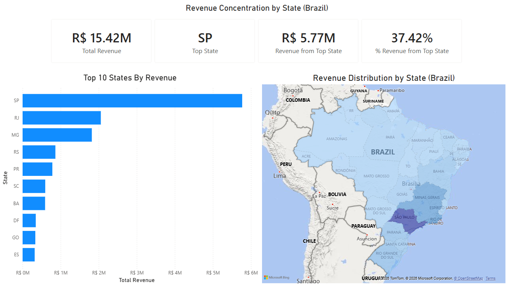

# E-Commerce Revenue Analysis Dashboard

## Overview
This project analyzes e-commerce performance using SQL and Power BI, focusing on customer behavior, geographic revenue distribution, and revenue trends over time.

## Tools Used
- SQL (PostgreSQL / DBeaver)
- Power BI
- DAX

## Key Insights
- Repeat customers represent ~3% of customers but generate ~5.6% of total revenue
- Revenue is highly concentrated in São Paulo (~37% of total revenue)
- Revenue growth is primarily driven by increased order volume rather than higher spending per order

## Dashboard Preview

### Customer Behavior

### Geographic Revenue

### Revenue Trends

## Files Included
- Power BI dashboard (.pbix)
- SQL queries used for analysis
- Dashboard screenshots
