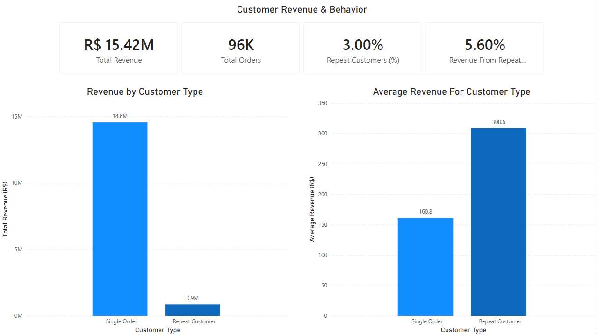
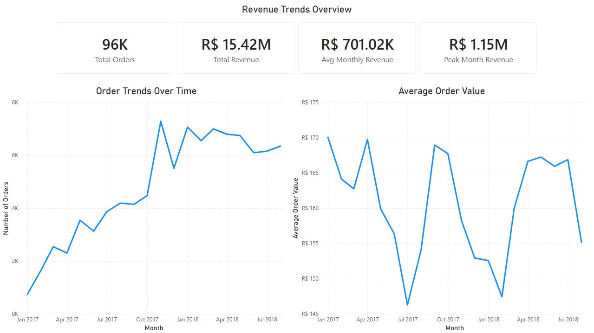

# E-Commerce Revenue & Customer Analysis Dashboard

## Overview

This project analyzes e-commerce performance using SQL and Power BI, with a focus on understanding customer behavior, revenue distribution, and growth drivers.

The goal was to identify **what drives revenue**, **where it is concentrated**, and **how customer purchasing patterns impact overall business performance**.

---

## Tools Used

* SQL (PostgreSQL / DBeaver)
* Power BI (Data modeling & visualization)
* DAX (calculated measures and KPIs)

---

## Data Preparation

* Joined multiple datasets (customers, orders, order_items, payments) to create a unified analytical model
* Filtered to **delivered orders only** to ensure accurate revenue reporting
* Aggregated payment data at the order level to avoid duplication
* Created structured views for:

  * Customer revenue
  * Product performance
  * Yearly revenue trends

---

## Key Insights

### Customer Behavior

* Repeat customers represent ~3% of customers but generate ~5.6% of total revenue
* Suggests opportunity for retention strategies and loyalty programs

### Geographic Revenue Distribution

* Revenue is highly concentrated in São Paulo (~37% of total revenue)
* Highlights regional dependency and potential geographic risk
* Opportunity to expand into underperforming regions

### Revenue Trends

* Revenue growth is primarily driven by increased order volume
* Average revenue per order remains relatively stable
* Suggests growth is coming from acquisition rather than increased customer spend

---

## Dashboard Features

* KPI cards for total revenue, total orders, and customers
* Customer segmentation (single vs repeat buyers)
* Geographic visualization of revenue by state
* Time-series analysis of revenue and order volume
* Interactive filters for dynamic exploration

---

## Dashboard Preview

### Customer Behavior

---

### Geographic Revenue

---

### Revenue Trends

---

## Files Included

* Power BI dashboard (.pbix)
* SQL queries used for analysis
* Dashboard screenshots

---

## What I Learned

* How to structure raw transactional data into an analytical model
* Importance of filtering and data validation (e.g., excluding canceled orders)
* How to translate business questions into SQL queries and dashboard visuals
* Designing dashboards that communicate insights clearly and effectively
